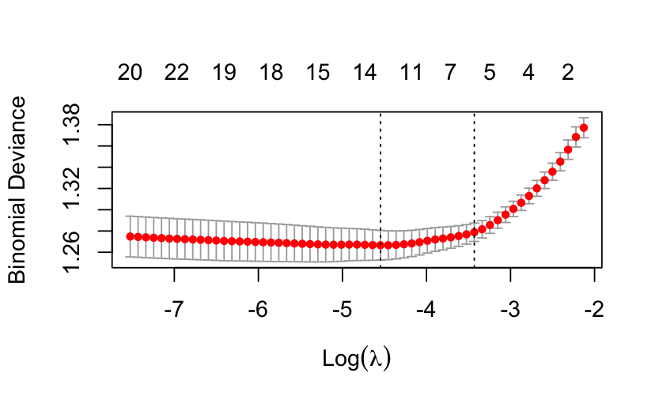

The initial model created was a logistic regression model with the Predicted Outcome Success varible being our binary reponse and using all other numeric variables as predictors. The intention was to understand if in this darts at the wall model would yield any statistically significant variables - Full-time Result Home Win (p \< 0.00556), Away Yellow (p \< 0.01577), Bet 365 Away Closing Odds (p \< 0.03799).This generally didn't tell us much about our initial research question outside of that Away Yellow was significant.

After the initial logistic regression model was performed, LASSO was used for model selection. The model was created and first performed on the entire EPL_New.csv data set.

{width="308"}

{width="315"}

{width="470"}

The first lasso created was untrained and predicted over the entire dataset the resulting minimal $\lambda = 0.01059308$ and an accuracy rating marginally better than a coin flip. As a result we created another lasso model, training this time on matches from years 2020 - 2021 and testing it it on matches played throughout 2022.

{width="319"}

{width="472"}
