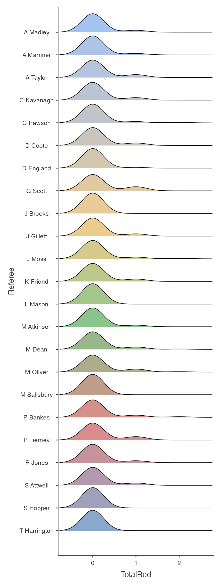
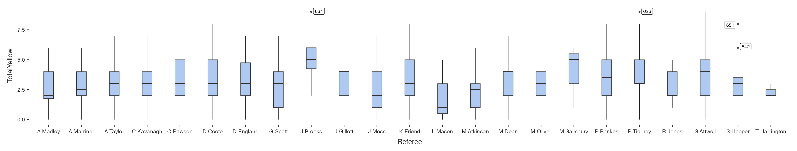

## Abstract

The English Premier League has seen a noticeable rise in US viewership over recent years - contributing to the already wide scale popularity of the sport. No matter the sport, refereeing seems to be a major speaking point across fan bases whether that be the call inconsistencies, missed calls, or speculative fouls. The purpose of this report and analyses is to understand whether there is an inconsistency in refereeing and whether or not it has a significant impact on the result of any given match - although this goal pivoted slightly during the model creation process.

## Methodology

The model creation process in this report started the final_dataset.csv file dowloaded from Kaggle.com with variables regarding Home/Away team, total booking points, Away/Home Cards, Referee, etc. Using this data we generated some variables seen on the EPL_New.csv some of these are Predicted Outcome Success (POS), Expected Result (ExpectedR), Expected Result Odds (ERO), Home/Away/Total Booking Points (HBP,ABP,TBP). Other variables that were taken into consideration were Bet365 Closing Odds.

POS and ExpectedR were both treated as binary variables. Although in english football matches can result in a draw - bookies release closing odds based on whether a team wins or losings. Fitting a logistic regression model with a draw wouldn't make much sense.

This report contains initial data analysis and exploration, logistic regression, Lasso variable selection and model prediction. The analyses and visualizations done within this report was created with a combination of RStudio, Jamovi, Jupyter Notebook.

## Discussion

Initially the question we wanted to answer was did booking points - points calculated by yellow/red cards given during the match - significantly impacted a match's outcome. Following this curiosity we wanted to know if there was consistency between the yellow/red cards given throughout a game and the referee's issuing them.

{width="229"}

Since red cards are issuance is rare in the EPL it's to no surprise that the density plots show that most referees don't issue red cards much - this was expected given what we know about the EPL.

This photo depicts the differences between referees and their yellow card issuance rate. We noticed that yellow card issuance (on a game-to-game basis) highly varied between referees. This visualization peaked our interest and sparked our initial research question. We figured that there was going to be variability between referees; however, we didn't expect this much variable among yellow card issuance.

Continuing our in our exploratory process we wanted to understand how many booking points a team received given the amount of fouls they had committed. (JUAN - EXPLAIN THE NORMALIZED BOOKING POINTS)
